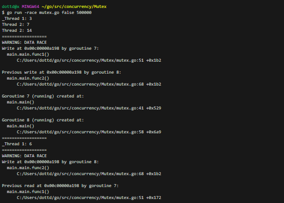

# Mutex Example

This Go program demonstrates mutual exclusion using mutexes for synchronization.
It allows to test code behavior with and without race conditions, highlighting the importance of protecting shared resources in concurrent applications.

## How to Use

1. **Compile the Program**:
   - Before running the program, you can compile it using the following command:
     ```
     go build mutex.go
     ```

2. **Run with Race Condition Testing**:
   - To test and observe race conditions, run the program with the `-race` flag. This flag enables Go's race condition detector.
     ```
     go run -race mutex.go true
     ```

3. **Run without Race Condition Testing**:
   - To run the program without race condition detection (protected access), you can use the following command:
     ```
     go run mutex.go false
     ```

## What It Does

- The program creates two threads (goroutines) that perform calculations concurrently.
- It uses a mutex (`sync.Mutex`) to protect access to shared variables when the `-race` flag is set to `true`. This protects against race conditions by allowing only one thread to access the shared resources at a time.
- When the `-race` flag is set to `false`, there is no protection (unprotected access) to the shared variables, which may result in race conditions.

## Output

- With race condition testing enabled (`true`), the program may identify and report race conditions if they occur.
- Without race condition testing (`false`), the program demonstrates the effects of unprotected concurrent access to shared variables.


## Code Structure

- `calculateProtected`: A function that performs calculations with protected access using a mutex.
- `calculateUnprotected`: A function that performs calculations without protection, allowing concurrent access.
- `sleep`: A function that introduces a small delay for demonstration purposes.

**Note**: The `-race` flag is used for testing and identifying race conditions. When running the program without the flag, it's important to understand that race conditions might occur without being detected by the Go race condition detector.

---
